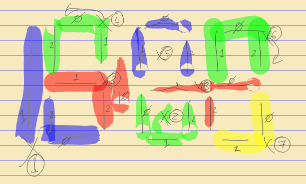

# Micropython challenges September 2020

## Introduction to MicroPython

An ESP32 board is available with micropython flashed to it and set up with a temperature and humidity sensor, a touch button, some neopixel LEDs and an I2C 7 segment display. 

The neopixels (WS2812) are connected to pin 16. There are two boards of neopixels each with 7 LEDs connected in series.

The capacitive touch button is a TTP223 configured to give a high signal (only) while it is being touched. It is connected to pin 5. 

The temperature and humidity sensor is a DHT11 and is connected to pin 26. 

The display is a 4 digit 7 segment display with Holtek HT16K33 chip giving an I2C interface to control it. SDA is connected to pin 18 and SCL to pin 19.

### Connecting to the micropython board

You should be able to connect to the micropython board  [here](http://micropython.org/webrepl/#bodaegl.ormiret.com:8277/). The password will be given in the call.

### Blink the LEDs

Setup control of the neopixels, and switch them on and off and to some different colours. 

Write a function to blink one board and then the other. 

What other animations can you write?

[example](hints/blink.py)

### Read button press

Setup the touch button. 

Then have it controlling the LEDs: change the colour displayed each time it is touched; have an animation running on the LEDs and stop, start or change it when the button it touched.

[example](hints/button.py)

### Read from temperature sensor

Read values from the DHT11 sensor. 

[example](hints/temp.py)

### Write to the 7 segment display

Setup control of the display. 

There is a library for the HT16K33 chip [here](https://github.com/hybotics/micropython-adafruit-ht16k33), this is installed on the board and available as `ht16k33` module.

Show the temperature on the display. 

[example](hints/disp.py)

### Write a stopwatch

Start/stop timing when the button is touched and show the time on the display. 

### Display air quality

Fetch the current air quality from one of the luftdaten sensors (e.g. http://data.sensor.community/airrohr/v1/sensor/22549/ ) and display the values on either/both of the 7 segment display and the LEDs.

### More

What else can you think of to do with this hardware?

## Clock

I have a large clock made up of 7 segment digits, with each segment being a length of 12V UV LED tape controlled by a series of p9813 LED controller ICs. 

The wiring was picked to be convenient for construction rather than being logical for controlling the clock: 

 

Numbers in circles give the sequence of p9813 modules from 1 to 8. 

For each p9813 module the segments of the display it is connected to are highlighted and labelled 0, 1, 2

This might be slightly wrong - it definitely was initially and I'm not sure if this is the corrected version of the connections or not...

You should be able to connect to the micropython board connected to the clock [here](http://micropython.org/webrepl/#bodaegl.ormiret.com:8279/). The password will be given in the call.

Can you make it display numbers? Can you display the actual time?

There is a library for controlling the p9813 boards [here](https://github.com/mcauser/micropython-p9813)

I have a source for the current UTC time in simple JSON [here](http://idea.bodaegl.com/time.json)
