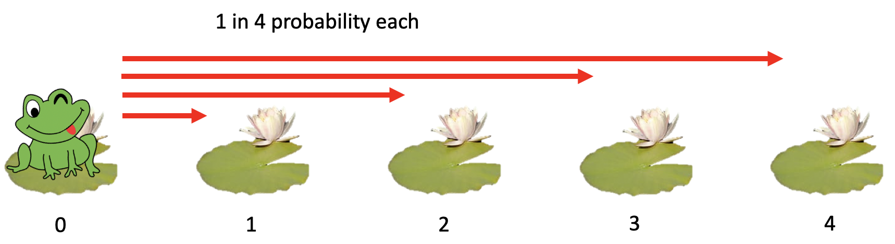
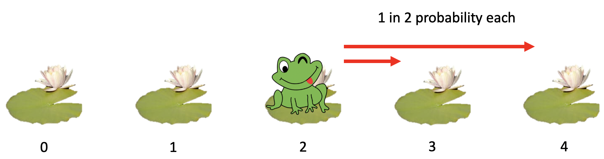

Click the arrows below to view this month's challenge problems. You can also view [previous months](/previous).

# February 2020

  
Level 1 - TBC

  
Level 2 - Russian Multiplication

  
  Russian Multiplication
  
  The problem requires you to implement an unusal multiplication algorithm for positive integers.
  
  Let's mulitply **42 × 1337**. But instead of using normal mulitplication, we will use a method which only uses halving, doubling, and addition!

First, we write the two numbers **a** and **b** in a table (which is which doesn't matter because a×b is the same as b×a, but you'll see it's faster if we put the smaller number on the left).

|  a |     b |
| -: | ----: |
| 42 |  1337 |

Now we complete the first column by halving **a** on each line. 42 halves to give 21. 21 halves to give 10 (don't worry about the fraction part). 10 halves to give 5. 5 halves to give 2 (don't worry about the fraction part). 2 halves to give 1. Now we stop at 1.

|  a |     b |
| -: | ----: |
| 42 |  1337 |
| 21 |       |
| 10 |       |
|  5 |       |
|  2 |       |
|  1 |       |

Since we kept halving **a**, we should double **b** the same number of times. Since we're doubling, no need to worry about any fractions, just double as you normally would.

|  a |     b |
| -: | ----: |
| 42 |  1337 |
| 21 |  2674 |
| 10 |  5348 |
|  5 | 10696 |
|  2 | 21392 |
|  1 | 42784 |

Next, we delete any rows where **a** is even, like the rows where **a** is 42, 10, or 2.

|  a |     b |
| -: | ----: |
| 21 |  2674 |
|  5 | 10696 |
|  1 | 42784 |

And lastly, we add up the **b** column: 2674 + 10696 + 42784 = 56154.

And if you check, magically your origonal two numbers muliutply to give the same number! 42 × 1337 = 56154

Write a Python function to do this proceedure.

Example usage:

    >>> russian_multiplication(42, 1337):
    56154

You may want to try other pairs of positive integers to make sure it works.

If you have time, try writing your tests as unit tests.
  

  
Level 3 - The Frog Problem

  
  ## The Frog Problem
  
This problem requires you to write a simulation of a system involving randomness.

A frog wants to get from it's current lily pad (pad `0`) to another lily pad `n` pads are (pad `n`)

For example, if `n=4`, there are 5 total pads (0 to 4).

The frog can hop as far as it wants in a single bound! But it likes to randomly choose any of the lily pads in front of it (with equal probability) and hop to that one.

Once hopped, it again, randomly chooses any of the lily pads in front of it (with equal probability) and hops to that.

When it reaches lily pad `n` (in this case 4), the frog is home.

The frog can take in total anywhere between 1 and n hops to get home.

First, write a function which simulates the frog's journey once. The parameter `n` is the distance the frog has to travel (1 less than the number of pads).

**Since it is random, it will vary from run-to-run!!!**

Example usage:

    >>> simulate_frog(4):
    2

    >>> simulate_frog(4):
    2

    >>> simulate_frog(4):
    1

    >>> simulate_frog(4):
    3

Next, add a named parenter which allows your function to repeate the simulation many times and return the average (mean) number of hops the journey took.

    >>> simulate_frog(4, simulations=1000000):
    2.082791

The answer will vary, but you should get around `2.08` for `n=4`.

Fill in the table with the results from your simulation, and try to find a pattern.

| n         | Average Number of Hops |
| --------: | ---------------------: |
| 0         | 0 |
| 1         | 1 |
| 2         | ... |
| 3         | ... |
| 4         | ~ 2.08 |
| 5         | ... |
| ... | ... |

Work out how many hops it will take on average for `n = 1,000,000` (Hint: compare each entry in the table above to the previous row to work out a formula)

