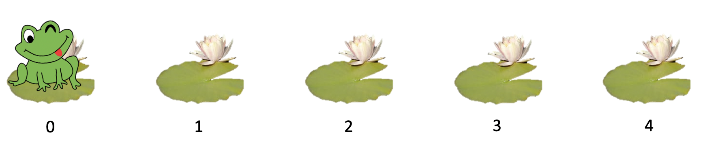

**Notice:**

We are looking for feedback from APUG attendees to help us improve the meetup.

There is an [anonymous survey](https://forms.gle/cHzxANBttdx8536g8) which should only take 5 minutes to complete.

-----

Click the arrows below to view this month's challenge problems. You can also view [previous months](/previous).

# February 2020

  
Level 1 - Password Strength Rater

  
  ## Password Strength Rater
  
  In this puzzle we will build a password strength rater. The exercise is split into steps, with some links to tips which will be useful if you are just getting started!
  
  ### Writing a Python Function

Write a function which takes as arguments, the user's `username` and `password` and gives a score to their password.

To start with we can just return a score of `0`.

    def rate_password(username, password):
        score = 0
        return score

Now check to see if your function works, at the moment it should always return `0`. Below, the part next to the `>>>` indicated the function call to make, and the line below indicates the expected output.

    >>> rate_password('bob', 'python')
    0
  
  Tips: [Python Functions](https://www.w3schools.com/python/python_functions.asp)
  
  ### Rating Password Length

To start with, give the user 1 point for each character in the length of the password.

|  Criteria                                                   | Score                     |
| :---------------------------------------------------------- | ------------------------: |
| Score given for length                                      |  + 1 point per character  |

Example usage:

    >>> rate_password('bob', '')
    0

    >>> rate_password('bob', 'a')
    1

    >>> rate_password('bob', 'python')
    6

Tips: [Python string length](https://www.geeksforgeeks.org/python-string-length-len/)

### Rating Character Types

Now we want to give extra points if the password contains certain types of characters. 3 points is it contains a-z, 3 points for A-Z, and 5 points for 0-9.

Remember to add all of these togethor with the length score!

For example, `Pass42word` contains 10 characters (a score of 10), plus 2 (for a-z), plus 3 (for A-Z), plus 5 (for 0-9), giving 20 points.

A password will be graded using the following criteria:

|  Criteria                                                   | Score                     |
| :---------------------------------------------------------- | ------------------------: |
| Score given for length                                      |  + 1 point per character  |
| Contains at least 1 lower-case letter (a-z)                 |  + 2 points               |
| Contains at least 1 upper-case letter (A-Z)                 |  + 3 points               |
| Contains at least 1 digit (0-9)                             |  + 5 points               |

    >>> rate_password('bob', 'Pass42word')
    20
    
    >>> rate_password('bob', 'pass42word')
    17
    
    >>> rate_password('bob', '12345')
    5

Try writing some other test cases to check your function works.

Tips: [How to check if character in string is a letter? Python](https://stackoverflow.com/questions/15558392/how-to-check-if-character-in-string-is-a-letter-python)

### More Characters

Next, lets add for more character checks.

If the password contains any spaces, give 5 extra points, and any characters **not** in a-z, A-Z, or 0-9, or spaced, give an extra 10 points.

|  Criteria                                                   | Score                     |
| :---------------------------------------------------------- | ------------------------: |
| Score given for length                                      |  + 1 point per character  |
| Contains at least 1 lower-case letter (a-z)                 |  + 2 points               |
| Contains at least 1 upper-case letter (A-Z)                 |  + 3 points               |
| Contains at least 1 digit (0-9)                             |  + 5 points               |
| Contains a space                                            |  + 5 points               |
| Contains any other character                                |  + 10 points              |

This password gets 10 points for containing a character not listed above (plus 9 for length)

    >>> rate_password('bob', 'おはようございます')
    19

This one get's 5 points for having at least one space (plus remember the other critera)

    >>> rate_password('bob', 'Bob cat 猫')
    29
    
### Penalty

Finally, let's add a penalty for including the username in the password. If the pasword contians the username (even in a different casing) the score loses 15 points!

|  Criteria                                                   | Score                     |
| :---------------------------------------------------------- | ------------------------: |
| Score given for length                                      |  + 1 point per character  |
| Contains at least 1 lower-case letter (a-z)                 |  + 2 points               |
| Contains at least 1 upper-case letter (A-Z)                 |  + 3 points               |
| Contains at least 1 digit (0-9)                             |  + 5 points               |
| Contains a space                                            |  + 5 points               |
| Contains any other character                                |  + 10 points              |
| Contains username (case-insensitive)                        |  - 15 points              |
| Minimum score                                               |     0 points              |

    >>> rate_password('bob', 'BoX cat 猫')
    29
    
    >>> rate_password('bob', 'BoB cat 猫')
    14

Limit the minimum score to 0, so under the other rules, this would get a score of 3+2-15 = -10, but we want to scores to start at 0. So any negative score turns into 0.

    >>> rate_password('bob', 'bob')
    0

    >>> rate_password('bob', 'bobbobbobbob')
    0

    >>> rate_password('bob', 'bobbobbobbobbob')
    2

Tips: [How to Check if a Python String Contains Another String?](https://www.afternerd.com/blog/python-string-contains/)

Tips: [Python String Methods: str(), upper(), lower(), count(), find(), replace() & len()](https://thehelloworldprogram.com/python/python-string-methods/)

  
Level 2 - Russian Multiplication

  
  ## Russian Multiplication
  
  The problem requires you to implement an unusal multiplication algorithm for positive integers.
  
  Let's mulitply **42 × 1337**. But instead of using normal mulitplication, we will use a method which only uses halving, doubling, and addition!

First, we write the two numbers **a** and **b** in a table (which is which doesn't matter because a×b is the same as b×a, but you'll see it's faster if we put the smaller number on the left).

|  a |     b |
| -: | ----: |
| 42 |  1337 |

Now we complete the first column by halving **a** on each line. 42 halves to give 21. 21 halves to give 10 (don't worry about the fraction part). 10 halves to give 5. 5 halves to give 2 (don't worry about the fraction part). 2 halves to give 1. Now we stop at 1.

|  a |     b |
| -: | ----: |
| 42 |  1337 |
| 21 |       |
| 10 |       |
|  5 |       |
|  2 |       |
|  1 |       |

Since we kept halving **a**, we should double **b** the same number of times. Since we're doubling, no need to worry about any fractions, just double as you normally would.

|  a |     b |
| -: | ----: |
| 42 |  1337 |
| 21 |  2674 |
| 10 |  5348 |
|  5 | 10696 |
|  2 | 21392 |
|  1 | 42784 |

Next, we delete any rows where **a** is even, like the rows where **a** is 42, 10, or 2.

|  a |     b |
| -: | ----: |
| 21 |  2674 |
|  5 | 10696 |
|  1 | 42784 |

And lastly, we add up the **b** column: 2674 + 10696 + 42784 = 56154.

And if you check, magically your origonal two numbers muliutply to give the same number! 42 × 1337 = 56154

Write a Python function to do this proceedure.

Example usage:

    >>> russian_multiplication(42, 1337):
    56154

You may want to try other pairs of positive integers to make sure it works.

If you have time, try writing your tests as unit tests.
  

  
Level 3 - The Frog Problem

  
  ## The Frog Problem
  
This problem requires you to write a simulation of a system involving randomness.

A frog wants to get from it's current lily pad (pad `0`) to another lily pad `n` pads are (pad `n`)

For example, if `n=4`, there are 5 total pads (0 to 4).

The frog can hop as far as it wants in a single bound! But it likes to randomly choose any of the lily pads in front of it (with equal probability) and hop to that one.

Once hopped, it again, randomly chooses any of the lily pads in front of it (with equal probability) and hops to that.

When it reaches lily pad `n` (in this case 4), the frog is home.

The frog can take in total anywhere between 1 and n hops to get home.

First, write a function which simulates the frog's journey once. The parameter `n` is the distance the frog has to travel (1 less than the number of pads).

**Since it is random, it will vary from run-to-run!!!**

Example usage:

    >>> simulate_frog(4):
    2

    >>> simulate_frog(4):
    2

    >>> simulate_frog(4):
    1

    >>> simulate_frog(4):
    3

Next, add a named parenter which allows your function to repeate the simulation many times and return the average (mean) number of hops the journey took.

    >>> simulate_frog(4, simulations=1000000):
    2.082791

The answer will vary, but you should get around `2.08` for `n=4`.

Fill in the table with the results from your simulation, and try to find a pattern.

| n         | Average Number of Hops |
| --------: | ---------------------: |
| 0         | 0 |
| 1         | 1 |
| 2         | ... |
| 3         | ... |
| 4         | ~ 2.08 |
| 5         | ... |
| ... | ... |

Work out how many hops it will take on average for `n = 1,000,000` (Hint: compare each entry in the table above to the previous row to work out a formula)

Use a plotting library to generate a plot with `n` on the x-axis and Average number of hops on the y-axis. Try plotting on the smae chart, both your simulation results, and prediction for an explicit formula and see how they match up!

